# Plataforma Protocolo HIS

A **Plataforma Protocolo HIS** é uma aplicação web open source destinada a executar, documentar e aperfeiçoar o **Protocolo de Avaliação da Receptividade Normativa à Produção de Habitação de Interesse Social**.

O projeto organiza, em um único processo rastreável, a passagem da legislação municipal ao relatório final de avaliação: recebe e preserva os arquivos, prepara o corpus, estrutura a legislação, percorre o sistema normativo, aplica as vinte variáveis, apoia a curadoria humana, integra os resultados e produz uma agenda fundamentada de aperfeiçoamento regulatório.

> **Tese central:** o principal bloqueio regulatório à HIS nem sempre aparece como proibição expressa. Com frequência, ele se forma no intervalo entre a diretriz favorável e sua conversão em território, parâmetros, instrumentos, procedimentos e decisões administrativas efetivamente operáveis.

---

## Sumário

- [Visão geral](#visão-geral)
- [Problema público](#problema-público)
- [Objetivos](#objetivos)
- [O que o Protocolo avalia](#o-que-o-protocolo-avalia)
- [Fluxo geral](#fluxo-geral)
- [As vinte variáveis](#as-vinte-variáveis)
- [Fluxo interno de cada variável](#fluxo-interno-de-cada-variável)
- [Classificação e rastreabilidade](#classificação-e-rastreabilidade)
- [Arquitetura da plataforma](#arquitetura-da-plataforma)
- [Estado atual](#estado-atual)
- [Roadmap até o MVP funcional](#roadmap-até-o-mvp-funcional)
- [Critérios de aceite do MVP](#critérios-de-aceite-do-mvp)
- [Instalação e operação](#instalação-e-operação)
- [Interface web](#interface-web)
- [Testes e qualidade](#testes-e-qualidade)
- [Princípios metodológicos](#princípios-metodológicos)
- [Fundamentação do projeto](#fundamentação-do-projeto)

---

## Visão geral

A regulação urbana, edilícia e fundiária condiciona:

- onde a HIS pode ser implantada;
- quais tipologias são admitidas;
- quantas unidades podem ser produzidas;
- que parâmetros físicos precisam ser cumpridos;
- quais documentos e aprovações são exigidos;
- quanto tempo e incerteza entram no licenciamento;
- como a política habitacional se relaciona com mobilidade, infraestrutura, emprego e serviços.

Uma regra aparentemente neutra pode produzir efeito distributivo regressivo quando eleva custos, reduz escala, impede tipologias econômicas, prolonga o processo ou desloca a produção para áreas periféricas. O Protocolo HIS trata a regulação como uma intervenção pública sujeita a diagnóstico, avaliação, revisão e monitoramento.

A plataforma transforma essa metodologia em processo operacional, auditável e progressivamente reutilizável.


### Resultado pretendido por aplicação municipal

| Camada | Produto principal |
|---|---|
| Corpus | originais preservados, versões, hashes, inventário e conversão auditada |
| Estrutura normativa | atos, páginas, artigos, anexos, tabelas, mapas e remissões |
| C0 | sínteses, glossário, território, parâmetros, instrumentos, procedimentos e pendências |
| C1-C20 | candidatos, snapshots, decisões, cartões de evidência e classificações |
| C21-C22 | matriz integrada, conflitos, divergências, adjudicações e matriz final |
| Relatório | diagnóstico, matriz, entraves adicionais, agenda legislativa e referências |
| Aprendizado | métricas, falsos positivos, falsos negativos, regras e versões refinadas |

---

## Problema público

A produção de HIS depende de terra, financiamento, capacidade construtiva e ação pública, mas também da capacidade do ordenamento de transformar a prioridade habitacional em condições normativas concretas.

O Protocolo procura identificar cinco formas recorrentes de perda de efetividade:

1. **diretriz sem territorialização** — a HIS é reconhecida, mas não se definem áreas, eixos ou perímetros prioritários;
2. **permissão sem viabilidade** — o uso é admitido, mas os parâmetros inviabilizam escala, densidade ou tipologia;
3. **instrumento sem operação** — ZEIS, função social ou incentivos existem apenas nominalmente;
4. **procedimento sem proporcionalidade** — o licenciamento impõe custo, prazo e retrabalho incompatíveis com o risco;
5. **sistema sem governabilidade** — diplomas, anexos, vigências, mapas e entendimentos permanecem fragmentados ou pouco legíveis.

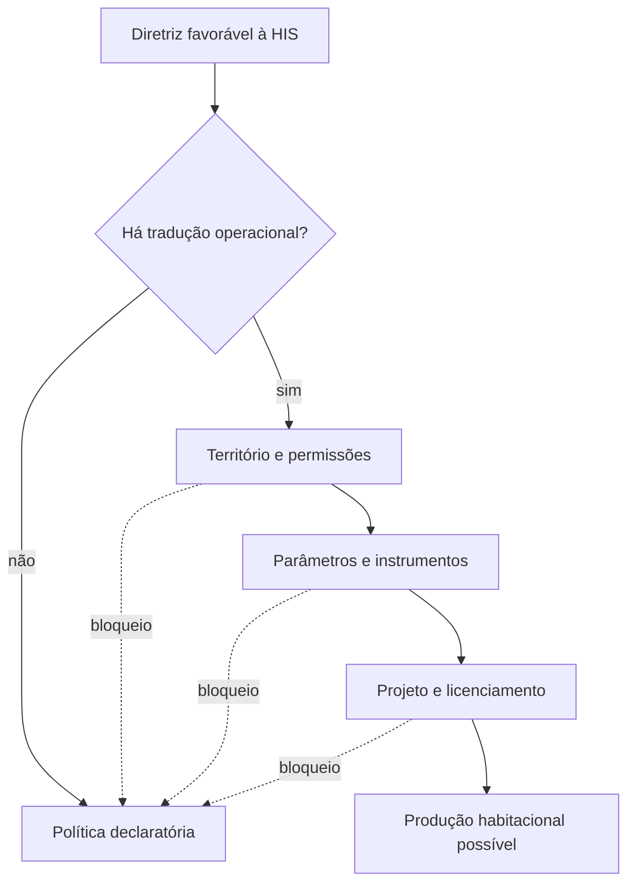

### Alcance da avaliação

A avaliação é **jurídico-textual e regulatória**. Ela examina condições normativas de possibilidade, coerência, clareza, aplicabilidade e efeitos prováveis.

Ela não mede, por si só:

- produção efetiva de unidades;
- preços de terra e imóveis;
- comportamento do mercado;
- desempenho administrativo agregado;
- causalidade entre uma regra e um resultado habitacional.

Esses elementos podem ser incorporados posteriormente como bases externas de avaliação de impacto e resultado regulatório.

---

## Objetivos

### Objetivo geral da plataforma

Executar um ciclo municipal completo, desde o recebimento da legislação até a geração de relatório rastreável, permitindo que cada decisão seja reconduzida ao arquivo, à página, ao artigo e à versão da metodologia utilizada.

### Objetivos conceituais

| Objetivo | Aplicação no Protocolo |
|---|---|
| Impacto regulatório | ler a norma por seus efeitos sobre custo, tempo, escala e localização |
| Simplicidade | reduzir camadas, redundâncias e zonas cinzentas que dificultam a execução |
| Objetividade | distinguir intenção programática de comando verificável e aplicável |
| Transparência | tornar critérios, fundamentos, versões e decisões acessíveis |
| Rastreabilidade | vincular interpretação e classificação à fonte normativa |
| Coerência vertical | verificar se LUOS, COE e instrumentos concretizam o Plano Diretor |
| Coerência horizontal | identificar contradições entre diplomas e setores |
| Proporcionalidade | calibrar exigências segundo risco, tipo e localização da intervenção |
| Desempenho | admitir meios equivalentes quando preservado o resultado técnico |
| “Sim claro” | exigir autorização inequívoca sobre quando, onde e como a HIS é admitida |

### Objetivos de política pública

- ampliar a oferta de HIS em áreas com infraestrutura, mobilidade, emprego e serviços;
- remover barreiras que elevam custo sem produzir valor público proporcional;
- utilizar melhor redes e equipamentos existentes;
- criar previsibilidade para investimento público, privado, comunitário e autogestionário;
- assegurar segurança, salubridade, acessibilidade e desempenho como patamar mínimo;
- tornar ZEIS e instrumentos fundiários efetivamente operáveis;
- reduzir prazos, retrabalho e variação decisória;
- capturar parte da valorização produzida por decisões públicas para financiar infraestrutura e HIS;
- instituir monitoramento capaz de recalibrar normas com base em resultados.

### Objetivos operacionais do MVP

- preservar arquivos originais e hashes;
- diagnosticar e converter documentos heterogêneos;
- rastrear dispositivos por página e artigo;
- provar cobertura integral do corpus;
- estruturar o contexto municipal C0;
- executar as vinte variáveis com recuperação documentada;
- manter a decisão humana separada da sugestão automatizada;
- registrar divergências, adjudicações e eventos de aprendizado;
- gerar matriz e relatório somente a partir de resultados validados.

---

## O que o Protocolo avalia

A unidade comparativa principal é o par **município × variável**. A unidade canônica de evidência é o **artigo legal**, lido com seus parágrafos, incisos, alíneas, itens, definições, exceções, tabelas, mapas, anexos e remissões relevantes.

As regras são examinadas por quatro lentes simultâneas:

| Lente | Pergunta central |
|---|---|
| Morfologia e localização | a regra amplia a possibilidade de HIS em áreas adequadas e conectadas? |
| Desempenho e licenciamento | protege fins públicos sem prescrever meios excessivos ou ritos desproporcionais? |
| Processo e impacto | altera custo, tempo, escala, densidade ou localização de forma identificável? |
| Legibilidade e atualização | é clara, coerente, atualizada e reconstruível dentro do sistema normativo? |

### Dimensões de impacto

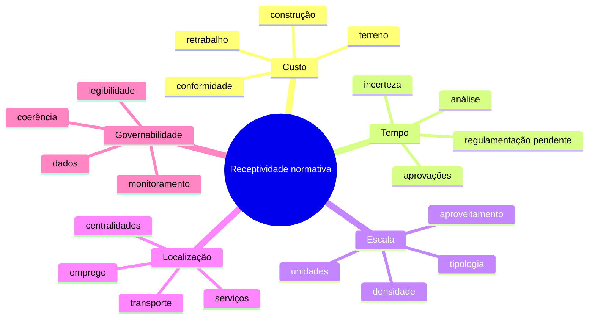

### Prova de conceito na Região Metropolitana do Recife

A aplicação a 14 municípios e 20 variáveis produziu 280 unidades analíticas. O resultado predominante foi a **parcialidade**: dispositivos existentes, porém incompletos, condicionados, contraditórios ou pouco operativos.

| Classificação | Ocorrências | Participação aproximada |
|---|---:|---:|
| Parcial | 171 | 61% |
| Aderente | 69 | 25% |
| Não verificável | 30 | 11% |
| Não atendida | 10 | 4% |

Esse resultado reforçou a hipótese de que o bloqueio mais frequente ocorre entre a previsão nominal e a condição normativa capaz de operar.

---

## Fluxo geral

O projeto consolidado prevê quatorze movimentos encadeados. Cada fase produz um resultado verificável antes de liberar a seguinte.

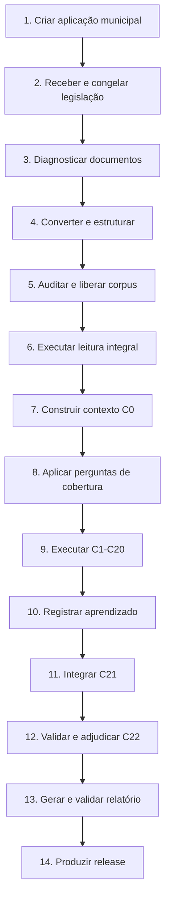

### Gates metodológicos previstos

| Gate | Condição de passagem |
|---|---|
| G0 | aplicação, município, equipe, protocolo e papéis configurados |
| G1 | corpus recebido, inventariado, hasheado e congelado |
| G2 | conversão concluída, com páginas, atos, artigos, anexos e manifestos |
| G3 | corpus auditado, rastreável e sem ocorrência crítica aberta |
| G4 | leitura integral concluída e cobertura demonstrada |
| G5 | contexto normativo C0 concluído |
| G6 | porta de compreensão da variável aprovada |
| G7 | recuperação inicial congelada, expansão e negativos auditados |
| G8 | C1-C20 concluídas, justificadas e documentadas |
| G9 | eventos de aprendizado registrados |
| G10 | integração C21 concluída |
| G11 | revisão e adjudicação C22 concluídas |
| G12 | relatório, DOCX, PDF, referências e release validados |

---

## As vinte variáveis

A matriz oficial possui vinte variáveis distribuídas em cinco blocos.

### Plano Diretor — PD-01 a PD-06

| Código | Variável | Objetivo analítico | Evidência buscada |
|---|---|---|---|
| **PD-01** | Diretrizes explícitas para HIS | verificar se a HIS é prioridade territorial e institucional inequívoca | comandos expressos, objetivos, diretrizes e vinculação dos instrumentos posteriores |
| **PD-02** | Áreas prioritárias: eixos, centralidades e perímetros de transformação | identificar onde o município pretende concentrar HIS e adensamento com infraestrutura | mapas, perímetros, centralidades, eixos de transporte e áreas de requalificação |
| **PD-03** | ZEIS reconhecidas e bem localizadas | verificar se a prioridade habitacional está territorializada em áreas adequadas | definição, localização, perímetro, categorias, parâmetros, incentivos e permanência social |
| **PD-04** | Instrumentos da função social da propriedade | avaliar a capacidade de mobilizar imóveis ociosos ou subutilizados | PEUC, IPTU progressivo, desapropriação-sanção, critérios, prazos e regulamentação |
| **PD-05** | Integração com regularização fundiária e urbanização de assentamentos | verificar se REURB e urbanização integram moradia, infraestrutura e inclusão urbana | programas, instrumentos, prioridades, articulação com saneamento, mobilidade e ambiente |
| **PD-06** | Compatibilização com política habitacional e planos setoriais | testar coerência entre planejamento urbano, habitação e políticas setoriais | plano habitacional, mobilidade, saneamento, ambiente, riscos, equipamentos e metas convergentes |

### Uso e Ocupação do Solo — LU-07 a LU-11

| Código | Variável | Objetivo analítico | Evidência buscada |
|---|---|---|---|
| **LU-07** | Permissão de HIS em zonas bem localizadas | verificar se a HIS é admitida no regime ordinário de áreas com oportunidades | usos permitidos, multifamiliar, zonas mistas, eixos, centralidades e condicionantes |
| **LU-08** | Parâmetros diferenciados para HIS | avaliar se índices urbanísticos permitem viabilidade econômica e diversidade tipológica | coeficiente, gabarito, taxa de ocupação, recuos, permeabilidade, vagas, bônus e exceções |
| **LU-09** | Lote mínimo e testada compatíveis com tipologias econômicas | identificar barreiras fundiárias à produção compacta, incremental ou autogestionária | área mínima, frente mínima, remembramento, desmembramento e regimes especiais |
| **LU-10** | Uso misto e térreos ativos em eixos com HIS | avaliar integração entre moradia, serviços, trabalho e vitalidade urbana | usos combinados, fachadas ativas, comércio de proximidade e incentivos em eixos |
| **LU-11** | Coerência normativa entre Plano Diretor e LUOS | verificar se permissões e parâmetros concretizam as diretrizes do Plano Diretor | correspondência de zonas, categorias, conceitos, mapas, parâmetros e instrumentos |

### Parcelamento e Regularização — PAR-12 a PAR-14

| Código | Variável | Objetivo analítico | Evidência buscada |
|---|---|---|---|
| **PAR-12** | Parâmetros mínimos compatíveis com inclusão e conectividade | avaliar se o desenho do parcelamento equilibra custo urbano, acesso e qualidade espacial | lotes, quadras, vias, conectividade, áreas públicas, infraestrutura e etapas de implantação |
| **PAR-13** | Parcelamentos especiais e soluções de lote urbanizado | verificar a existência de modalidades graduais e economicamente adequadas de produção | lote urbanizado, urbanização progressiva, regimes especiais, autogestão e assistência técnica |
| **PAR-14** | Regularização fundiária simplificada e integrada | avaliar se a regularização possui rito aplicável e conexão com qualificação territorial | REURB-S/E, legitimação, projeto, infraestrutura, licenciamento, ambiente e registro |

### Código de Obras e Licenciamento — COE-15 a COE-19

| Código | Variável | Objetivo analítico | Evidência buscada |
|---|---|---|---|
| **COE-15** | Compatibilidade com normas técnicas de desempenho e acessibilidade | preservar qualidade técnica evitando prescrições municipais redundantes ou conflitantes | remissões a normas técnicas, desempenho, equivalência, acessibilidade e responsabilidades |
| **COE-16** | Exigências proporcionais ao tipo e à localização da HIS | avaliar se obrigações edilícias são calibradas ao risco e ao contexto | classificação de risco, tipologia, retrofit, intervenção, uso, localização e soluções equivalentes |
| **COE-17** | Licenciamento proporcional e com autodeclaração | reduzir tempo e retrabalho sem diminuir proteção pública | rito simplificado, autodeclaração, aprovação responsável, prazos, checklists e fiscalização posterior |
| **COE-18** | Reconhecimento de sistemas construtivos industrializados | verificar abertura regulatória à inovação com desempenho comprovado | sistemas industrializados, avaliação técnica, certificação e equivalência de soluções |
| **COE-19** | Eliminação de redundâncias e conflitos no Código de Obras | avaliar inteligibilidade, atualização e coerência do estoque edilício | sobreposições, revogações, remissões, exigências duplicadas e consolidação normativa |

### Instrumentos Complementares — IC-20

| Código | Variável | Objetivo analítico | Evidência buscada |
|---|---|---|---|
| **IC-20** | ZEIS com parâmetros, incentivos e captura da valorização | verificar se o instrumento forma um regime completo de produção, permanência e retorno social | parâmetros dedicados, incentivos urbanísticos e financeiros, rito, contrapartidas, captura e controle da destinação |

### Perguntas comuns às vinte variáveis

Para cada variável, a análise deve responder:

1. o que a norma estabelece;
2. se o comando é explícito, claro e suficientemente determinado;
3. se existe territorialização, parâmetro, instrumento ou procedimento que permita sua operação;
4. se outro diploma confirma, restringe ou neutraliza o comando;
5. que efeito provável produz sobre custo, tempo, escala, densidade, localização e previsibilidade;
6. quais falsos positivos e falsos negativos precisam ser evitados;
7. se a evidência é suficiente para classificar ou se é necessário abster-se.

---

## Fluxo interno de cada variável

A mesma arquitetura será repetida para C1-C20, permitindo comparação entre estratégias de recuperação e aprendizado cumulativo.

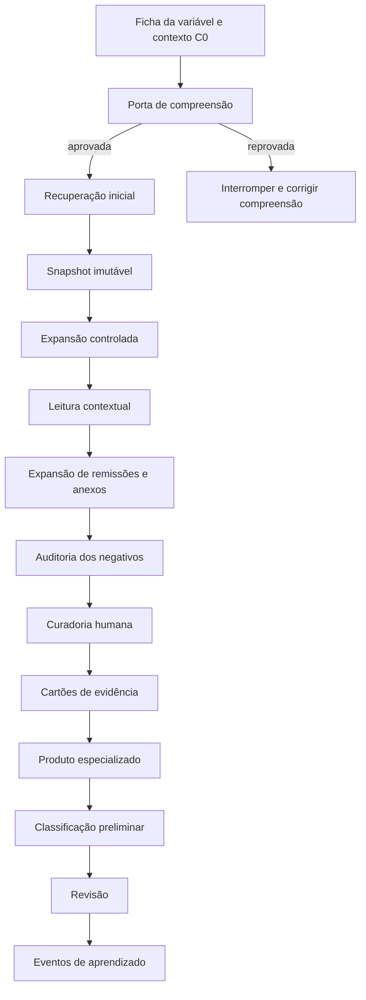

### Detalhamento

| Etapa | Resultado esperado |
|---|---|
| Ficha e contexto | definição, objetivo, critérios, perguntas-agulha, fontes, exemplos e produtos C0 |
| Porta de compreensão | demonstração do objeto, exclusões, evidências, variáveis vizinhas e regras de abstenção |
| Recuperação inicial | candidatos obtidos por seleção estrutural, busca lexical, semântica e análise contextual |
| Snapshot | conjunto inicial congelado antes da expansão |
| Expansão | termos locais, sinônimos, remissões, artigos próximos, anexos e exemplos anteriores |
| Leitura contextual | artigo integral, unidade hierárquica, definições, exceções e relações interinstrumentais |
| Auditoria dos negativos | revisão de artigos e diplomas não selecionados para localizar falsos negativos |
| Curadoria humana | decisão justificada sobre relevância, função, suficiência, conflito ou descarte |
| Cartão de evidência | fonte, trecho, função normativa, força, territorialidade, dependências e interpretação |
| Produto especializado | matriz, quadro, fluxo, simulação ou síntese adequada ao mecanismo da variável |
| Classificação | aderente, parcial, não atendida ou não verificável, com fundamento e limites |
| Revisão | conferência independente de seleção, interpretação e suficiência |
| Aprendizado | registro de erros, novos padrões, vocabulário, regras e ajustes de modelo |

### Canais de recuperação previstos

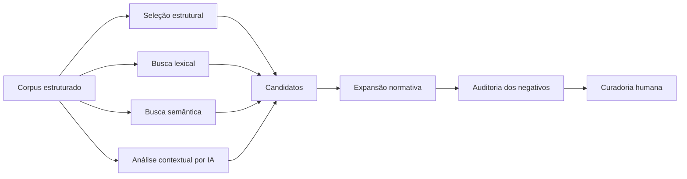

O canal de descoberta de cada candidato será registrado para medir a contribuição marginal da busca inicial, da expansão, das regras, da IA, do aprendizado de máquina e da revisão humana.

---

## Classificação e rastreabilidade

### Classificações finais

| Classe | Sentido |
|---|---|
| **Aderente — A** | comando operativo, suficientemente claro e conectado a território, parâmetros, instrumentos ou procedimentos |
| **Parcial — P** | conteúdo existente, mas incompleto, restrito, condicionado, contraditório ou de baixa operacionalidade |
| **Não atendida — NA** | ausência de base normativa suficiente ou presença de regra incompatível com o objetivo da variável |
| **Não verificável — NV** | corpus ou evidência insuficiente para decisão segura, sem presumir inexistência jurídica |

A categoria NV é um resultado metodológico relevante: anexos ausentes, mapas ilegíveis, vigência incerta ou diplomas não disponibilizados afetam a própria governabilidade da regulação.

### Cadeia de rastreabilidade

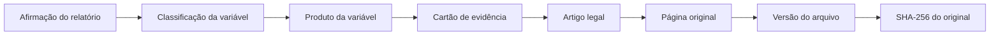

### Separação de camadas

| Fonte primária | Contexto derivado |
|---|---|
| arquivo original | síntese |
| página | tema |
| artigo | função normativa |
| tabela | parâmetro normalizado |
| mapa | relação territorial |
| anexo | candidato, resposta ou interpretação |

Todo contexto derivado deverá registrar fontes, trechos, páginas, ferramenta ou modelo, prompt, parâmetros, execução, versão, confiança e estado de validação.

---

## Arquitetura da plataforma

### Arquitetura-alvo

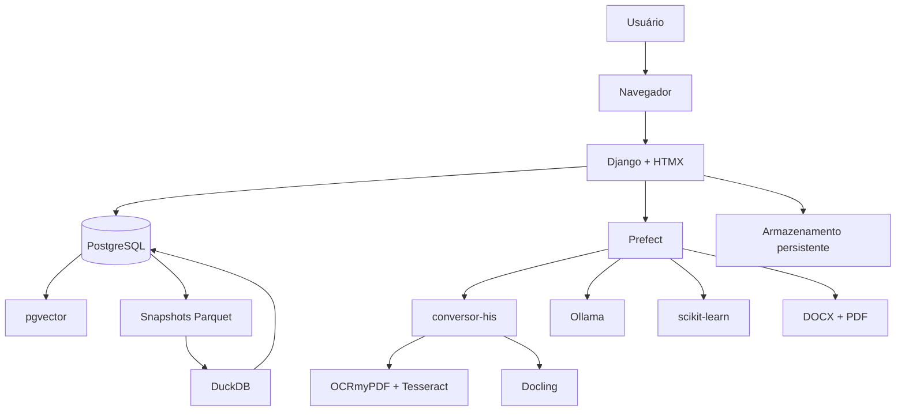

### Responsabilidades

| Componente | Responsabilidade principal | Estado |
|---|---|---|
| Django | interface, usuários, aplicações, estados, curadoria, decisões e histórico | implementado parcialmente |
| PostgreSQL | fonte oficial de dados funcionais e metodológicos | implementado |
| Sistema de arquivos | originais imutáveis e artefatos derivados | implementado |
| conversor-his | diagnóstico, extração, OCR seletivo, Markdown, manifestos e ativos | integrado parcialmente |
| Markdown viewer | leitura de PDF, Markdown e comparação | implementado |
| HTMX | interatividade sem frontend separado | planejado |
| Prefect | orquestração, retomada, cache, paralelismo e reprocessamento seletivo | planejado |
| pgvector | recuperação semântica de artigos, perguntas e exemplos | planejado |
| Ollama | embeddings, leitura estruturada, classificação e síntese local | planejado |
| Docling | extração complementar de layouts e tabelas complexas | planejado |
| scikit-learn | modelos supervisionados artigo × variável | planejado |
| DuckDB + Parquet | benchmarks e análise de snapshots | planejado |
| docxtpl/python-docx | geração do relatório editável | planejado |
| PDF headless | geração e validação do relatório final | planejado |

### Princípios de arquitetura

- uma interface operacional única;
- PostgreSQL como fonte oficial da verdade;
- artigo como unidade canônica de rastreabilidade;
- originais imutáveis e derivados versionados;
- separação entre fonte e interpretação;
- separação entre sugestão automática e decisão humana;
- prompts, regras, modelos e configurações versionados;
- execuções reproduzíveis, retomáveis e auditáveis;
- reprocessamento seletivo após mudança de corpus, regra, prompt ou modelo;
- relatório produzido apenas a partir de resultados validados.

---

## Estado atual

A `main` reúne a fundação operacional e os primeiros incrementos documentais.

### Implementado

| Entrega | Situação |
|---|---|
| cadastro de municípios | ✅ |
| aplicações municipais | ✅ |
| catálogo de tipos normativos | ✅ |
| documentos e versões | ✅ |
| hashes SHA-256 e identificação de duplicatas | ✅ |
| preservação de originais | ✅ |
| qualificação documental | ✅ |
| diagnóstico página a página | ✅ |
| classificação de rota nativa, OCR, mista ou visual | ✅ |
| métricas, avisos e diagnóstico JSON | ✅ |
| conversão integrada ao `conversor-his` | ✅ |
| Markdown e pacote ZIP de conversão | ✅ |
| validação de hashes do original e do Markdown | ✅ |
| painel e navegação por aplicação, documento e processamento | ✅ |
| visualizador de PDF | ✅ |
| renderização segura de Markdown | ✅ |
| comparação PDF × Markdown | ✅ |
| inicializador completo do Windows | ✅ |
| testes da base, qualificação, interface, leitor e conversão | ✅, sujeitos à execução local |

### Parcialmente implementado

| Entrega | Situação atual | Lacuna para conclusão |
|---|---|---|
| ingestão | cadastro e upload pelo Admin | fluxo completo pela interface e congelamento formal do corpus |
| preparação documental | diagnóstico e conversão | gates G0-G3 completos e protocolo RAG v1.1 integral |
| rastreabilidade | página, processamento, artefatos e arquivos | segmentação persistente por ato e artigo |
| auditoria | inspeção PDF/Markdown e dados técnicos | ocorrências, adjudicação e liberação formal do corpus |
| operação web | páginas de consulta | ações operacionais sem linha de comando e acompanhamento de tarefas |

### Ainda não implementado

- autenticação e papéis metodológicos completos;
- Prefect e workers;
- biblioteca normativa por atos e artigos;
- leitura integral e livro de cobertura;
- contexto normativo C0;
- perguntas de cobertura;
- biblioteca versionada das vinte variáveis;
- recuperação lexical e semântica;
- snapshots de recuperação;
- curadoria e cartões de evidência;
- aprendizado supervisionado;
- C21 e C22;
- geração de DOCX/PDF e release final.

---

## Roadmap até o MVP funcional

### Visão por macroetapa

Legenda: ✅ concluído · 🟡 parcial/em desenvolvimento · ⬜ planejado

| Macroetapa | Entregas | Estado | Marco de conclusão |
|---|---|:---:|---|
| **R0 — Fundação de dados** | Django, PostgreSQL, municípios, aplicações, documentos, versões, hashes, Admin | ✅ | corpus e arquivos persistidos de modo rastreável |
| **R1 — Qualificação documental** | diagnóstico, rotas, páginas, métricas, artefatos e comando idempotente | ✅ | documento classificado antes da conversão |
| **R2 — Conversão e visualização** | conversor-his, Markdown, pacote auditável, PDF/Markdown e comparação | ✅ | conversão acessível e verificável pela interface |
| **R3 — Auditoria e release do corpus** | atos, artigos, rastreabilidade por dispositivo, ocorrências, anexos, gates e classes A/B/C-V1/V2/V3 | 🟡 | corpus liberado sem não conformidade crítica |
| **R4 — Leitura integral e C0** | livro de cobertura, sínteses, glossário, território, parâmetros, instrumentos, remissões e perguntas de cobertura | ⬜ | todos os artigos percorridos e contexto municipal disponível |
| **R5 — Núcleo C1-C20** | fichas, porta de compreensão, recuperação, snapshot, expansão, negativos, curadoria, cartões e classificação | ⬜ | vinte dossiês completos e justificados |
| **R6 — Aprendizado e métricas** | datasets, ML inicial, modo sombra, ranking, métricas por variável e regressão | ⬜ | aprendizado controlado sem substituir decisão humana |
| **R7 — Integração C21 e validação C22** | matriz, conflitos, dependências, revisões, divergências e adjudicação | ⬜ | matriz municipal final congelada |
| **R8 — Relatório e release municipal** | objeto estruturado, DOCX, PDF, referências, rastreabilidade e pacote final | ⬜ | relatório integral rastreável até a fonte |
| **R9 — MVP funcional** | ciclo completo operado pela interface, retomável e testado com corpus de referência | ⬜ | critérios de aceite integralmente atendidos |

### Roadmap detalhado

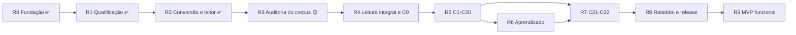

#### R3 — Auditoria e liberação do corpus

Objetivo imediato do próximo ciclo:

- persistir atos normativos separados;
- segmentar e identificar artigos;
- registrar páginas inicial e final por dispositivo;
- implementar marcadores e fontes por artigo;
- reconciliar sequência, lacunas e duplicidades;
- inventariar anexos, mapas, tabelas e coordenadas;
- registrar ocorrências e adjudicações;
- executar testes mínimos de recuperação por ato;
- emitir status de indexação e validação;
- gerar manifesto de release sem sobrescrever versões anteriores.

#### R4 — Leitura integral e C0

- percorrer artigo → seção → capítulo → título → diploma → sistema municipal;
- registrar tema e função normativa de todos os artigos;
- produzir livro de cobertura;
- extrair macrozoneamento, zoneamento, usos, tipologias e parâmetros;
- identificar instrumentos, procedimentos, remissões e fontes ausentes;
- produzir sínteses por seção e diploma;
- executar perguntas de cobertura e atualizar vocabulário local.

#### R5 — Operação C1-C20

- configurar fichas oficiais das vinte variáveis;
- versionar perguntas-agulha, critérios, regras e exemplos;
- implementar porta de compreensão;
- combinar seleção estrutural, busca lexical, semântica e análise contextual;
- congelar recuperação inicial;
- medir contribuição das expansões;
- auditar negativos;
- oferecer interface de curadoria e cartões de evidência;
- produzir classificação preliminar e revisão.

#### R6 — Aprendizado controlado

Maturidade prevista por variável:

| Nível | Uso |
|---|---|
| ML-0 | instrumentação e registro dos exemplos |
| ML-1 | benchmark retrospectivo |
| ML-2 | modo sombra, sem alterar a fila humana |
| ML-3 | priorização de candidatos |
| ML-4 | descoberta dirigida de omissões |
| ML-5 | apoio controlado à operação |

Modelos iniciais previstos: TF-IDF, regressão logística, SVM linear, árvores, calibração, combinação de scores, reranking e embeddings locais.

#### R7 — C21 e C22

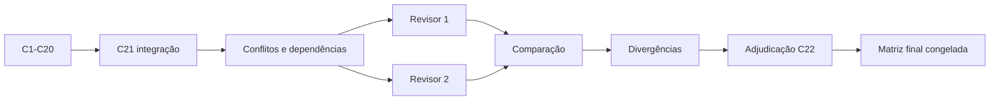

#### R8 — Relatório e release

O relatório municipal deverá conter:

1. identificação e síntese executiva;
2. método, escopo e base normativa;
3. classificação territorial;
4. matriz consolidada das vinte variáveis;
5. entraves regulatórios adicionais;
6. agenda de transformações legislativas;
7. conclusão integrada;
8. referências normativas e pacote de rastreabilidade.

---

## Critérios de aceite do MVP

O MVP será considerado funcional quando permitir, pela interface web:

- criar uma aplicação municipal e definir responsáveis;
- receber, preservar, hashear e congelar o corpus;
- diagnosticar os principais perfis documentais;
- converter documentos nativos, escaneados, mistos e visualmente complexos;
- auditar original e conversão;
- liberar corpus versionado e rastreável por página e artigo;
- navegar por atos, artigos, anexos e remissões;
- demonstrar leitura integral de todos os artigos;
- produzir contexto C0 com território, parâmetros, instrumentos e pendências;
- executar perguntas de cobertura;
- carregar fichas e prompts das vinte variáveis;
- aprovar a porta de compreensão;
- executar recuperação lexical e semântica;
- congelar a recuperação inicial;
- executar expansão e auditoria dos negativos;
- registrar curadoria e cartões de evidência;
- produzir e justificar C1-C20;
- registrar eventos de aprendizado e métricas;
- integrar C21;
- revisar e adjudicar C22;
- gerar relatório editável e PDF;
- rastrear cada afirmação central até a fonte original;
- gerar release versionado com hashes;
- exportar snapshots e executar testes de regressão.

### Definição mínima de pronto

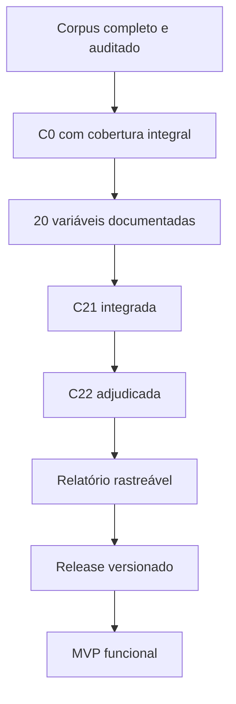

---

## Instalação e operação

### Tecnologias atualmente necessárias

- Python 3.12 ou superior;
- Django 5.2;
- PostgreSQL 17;
- psycopg 3;
- `conversor-his`;
- `markdown-it-py`;
- pytest e pytest-django;
- Ruff.

### Clonar e instalar

```powershell
git clone https://github.com/hilaliskandar/protocolo_his.git
cd protocolo_his
git switch main
```

Instale as dependências de desenvolvimento e qualificação:

```powershell
& "C:\Users\USER\.conda\envs\protocolo-his\python.exe" -m pip install -e ".[dev,qualificacao]"
```

### Configuração `.env`

```dotenv
DJANGO_SECRET_KEY=altere-esta-chave
DJANGO_DEBUG=true
POSTGRES_DB=protocolo_his
POSTGRES_USER=protocolo_his
POSTGRES_PASSWORD=altere-esta-senha
POSTGRES_HOST=127.0.0.1
POSTGRES_PORT=55432
PROTOCOL_DATA_ROOT=F:\ale_2_0\protocolo_his_local\data
```

Não versione senhas reais, chaves ou credenciais de produção.

### Ambiente local de referência

```text
Projeto:      F:\ale_2_0\protocolo_his_local
Python:       C:\Users\USER\.conda\envs\protocolo-his\python.exe
PostgreSQL:   C:\Program Files\PostgreSQL\17\bin
Cluster:      F:\ale_2_0\postgres_his_17\data
Banco:        protocolo_his
Host:         127.0.0.1
Porta:        55432
Django:       http://127.0.0.1:8000/
```

Esses caminhos representam o ambiente de desenvolvimento atual e podem ser adaptados.

### Inicialização completa no Windows

O repositório contém:

```text
scripts/windows/INICIAR_PROTOCOLO_HIS.bat
```

O inicializador:

- valida os caminhos locais;
- verifica o cluster PostgreSQL;
- inicia a porta 55432 apenas quando necessário;
- aguarda o banco aceitar conexões;
- executa `manage.py check`;
- inicia o Django;
- abre a plataforma no navegador.

Antes do primeiro uso, ajuste as variáveis no início do arquivo.

### Inicialização manual

```powershell
$py = "C:\Users\USER\.conda\envs\protocolo-his\python.exe"
$pg = "C:\Program Files\PostgreSQL\17\bin"
$data = "F:\ale_2_0\postgres_his_17\data"
$log = "F:\ale_2_0\postgres_his_17\postgresql.log"

& "$pg\pg_ctl.exe" status -D $data
if ($LASTEXITCODE -ne 0) {
    & "$pg\pg_ctl.exe" start -D $data -l $log -o "-p 55432"
}

& "$pg\pg_isready.exe" -h 127.0.0.1 -p 55432 -d protocolo_his
& $py manage.py runserver
```

Para encerrar o cluster:

```powershell
& "$pg\pg_ctl.exe" stop -D $data -m fast
```

### Preparação do banco

```powershell
& $py manage.py migrate
& $py manage.py createsuperuser
```

Admin:

```text
http://127.0.0.1:8000/admin/
```

### Qualificação documental

Por aplicação:

```powershell
& $py manage.py qualificar_documentos --aplicacao 1
```

Por documento ou versão:

```powershell
& $py manage.py qualificar_documentos --documento 1
& $py manage.py qualificar_documentos --versao 1
```

Reprocessamento:

```powershell
& $py manage.py qualificar_documentos --aplicacao 1 --forcar
```

### Conversão documental

A conversão exige qualificação concluída.

```powershell
& $py manage.py converter_documentos --aplicacao 1
& $py manage.py converter_documentos --documento 1
& $py manage.py converter_documentos --versao 1
```

DPI entre 150 e 600:

```powershell
& $py manage.py converter_documentos --aplicacao 1 --dpi 300
```

Reprocessamento:

```powershell
& $py manage.py converter_documentos --aplicacao 1 --forcar
```

A conversão produz Markdown, manifesto, tokens OCR, estrutura OCR, ativos visuais, métricas, avisos e pacote ZIP auditável.

---

## Interface web

| Página | Endereço |
|---|---|
| Painel | `http://127.0.0.1:8000/` |
| Aplicações | `http://127.0.0.1:8000/aplicacoes/` |
| Aplicação | `http://127.0.0.1:8000/aplicacoes/<id>/` |
| Documento | `http://127.0.0.1:8000/documentos/<id>/` |
| Leitor | `http://127.0.0.1:8000/documentos/<id>/leitor/` |
| Processamento | `http://127.0.0.1:8000/processamentos/<id>/` |
| Artefato | `http://127.0.0.1:8000/artefatos/<id>/` |
| Admin | `http://127.0.0.1:8000/admin/` |

### Modos do leitor

```text
?modo=pdf
?modo=markdown
?modo=comparacao
```

O PDF é servido inline. O Markdown é renderizado com HTML bruto desabilitado. O modo de comparação exibe os dois artefatos lado a lado quando a conversão estiver disponível.

### Modelos atualmente implementados

| Modelo | Função |
|---|---|
| `Municipio` | identificação e metadados territoriais |
| `AplicacaoMunicipal` | unidade de execução municipal do Protocolo |
| `TipoNormativo` | catálogo controlado de espécies normativas |
| `DocumentoNormativo` | diploma incluído no corpus |
| `VersaoDocumento` | arquivo recebido, imutável e identificado por hash |
| `ProcessamentoDocumento` | execução de qualificação, conversão ou validação |
| `DiagnosticoPagina` | diagnóstico técnico por página |
| `ArtefatoProcessado` | arquivo derivado vinculado a um processamento |

### Armazenamento

Originais:

```text
immutable/documentos/<documento_id>/<sha256>.<extensão>
```

Derivados:

```text
derived/processamentos/<processamento_id>/<sha256>.<extensão>
```

---

## Testes e qualidade

Execute antes de consolidar um incremento:

```powershell
& $py manage.py check
& $py -m ruff check .
& $py -m pytest -q
& $py manage.py makemigrations --check --dry-run
```

Resultados esperados:

```text
System check identified no issues
All checks passed!
Todos os testes aprovados
No changes detected
```

### Métricas previstas por camada

| Camada | Métricas |
|---|---|
| Documental | cobertura de páginas e artigos, segmentação, OCR, anexos, tempo por documento |
| C0 | artigos processados, zonas, parâmetros, remissões, fontes ausentes e pendências |
| Recuperação | Recall@k, Precision@k, F1, F2, contribuição por rodada e falsos negativos |
| ML | desempenho e calibração por variável, município e diploma; abstenção e curva de aprendizagem |
| Operação | tempo, falhas, retentativas, carga de revisão e tempo até release |
| Relatório | 20 variáveis completas, referências consistentes, afirmações suportadas e integridade DOCX/PDF |

Médias agregadas não compensarão falhas críticas como página ausente, mistura de atos ou artigo atribuído à norma errada.

---

## Princípios metodológicos

1. **Autonomia municipal na definição do corpus** — o universo é composto pelos diplomas informados pelo município como utilizados no planejamento, na política habitacional e no licenciamento.
2. **Original imutável** — o arquivo recebido é preservado e nunca sobrescrito.
3. **Uma norma por arquivo analítico** — atos diferentes não devem ser misturados no Markdown principal.
4. **Artigo como unidade canônica** — fragmentos subordinados são lidos com o comando e o contexto que lhes dão sentido.
5. **Não inferência** — dado ausente é registrado como não identificado ou não verificado.
6. **Rastreabilidade redundante** — hash, metadados, marcador por dispositivo e linha de fonte.
7. **Separação entre fonte e interpretação** — análise, síntese e classificação permanecem em objetos derivados.
8. **Leitura interinstrumental** — o sistema municipal é analisado como conjunto, não como coleção de leis isoladas.
9. **Postura conservadora** — conflitos, insuficiências e ambiguidades não são resolvidos artificialmente em favor da aderência.
10. **Automação assistiva** — IA amplia busca e organização, mas não substitui curadoria, classificação, revisão ou adjudicação.
11. **Reprodutibilidade** — ferramenta, versão, código, parâmetros, entradas, saídas, hashes e intervenções devem ser registrados.
12. **Versionamento** — correções geram nova versão e novo manifesto; releases anteriores permanecem disponíveis.
13. **Territorialidade responsável** — a análise distingue áreas adequadas à política habitacional de áreas protegidas por finalidades ambientais, rurais, patrimoniais, portuárias, industriais ou de risco.
14. **Não ranqueamento** — a matriz identifica densidade normativa, lacunas e prioridades; não constitui julgamento de mérito institucional dos municípios.

---

## Fundamentação do projeto

A concepção do Protocolo combina quatro famílias de referência:

| Referencial | Contribuição ao método |
|---|---|
| Regulação urbana e oferta habitacional | mecanismos de restrição, preço, densidade, tipologia e localização |
| Acessibilidade habitacional | relação entre moradia, renda residual, transporte, emprego e oportunidades |
| Avaliação de impacto regulatório | diagnóstico, alternativas, custos, benefícios, monitoramento e revisão |
| Governança e implementação | legibilidade, capacidade institucional, rastreabilidade e redução de entulho normativo |

Documentos estruturantes utilizados na consolidação desta visão:

- **Entre a diretriz e o bloqueio — Entraves regulatórios à produção de HIS: aplicação do Protocolo HIS na Região Metropolitana do Recife**;
- **Apresentação do estudo Protocolo HIS — RMR**;
- **Protocolo de Conversão Normativa para RAG v1.1**;
- **Projeto Consolidado do MVP — Plataforma Protocolo HIS**;
- **Síntese Executiva do MVP — Plataforma Protocolo HIS**;
- **Apostila Protocolo HIS — Avaliação de Receptividade Normativa à Produção Habitacional de Interesse Social**.

### Síntese do ciclo de conhecimento

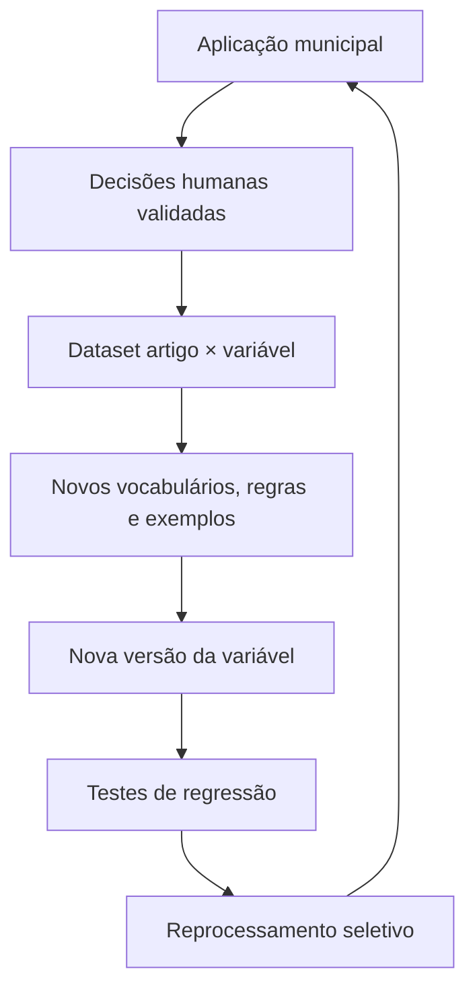

Cada nova aplicação deverá produzir um relatório municipal e, ao mesmo tempo, ampliar a capacidade do sistema de reconhecer as diferentes formas pelas quais as vinte variáveis se manifestam nos corpora urbanísticos, edilícios e fundiários.

---

<!-- INICIO: APENDICE-DECISOES-TECNOLOGICAS -->

## Apêndice — Decisões tecnológicas e critérios de escolha

## Finalidade

A arquitetura da Plataforma Protocolo HIS foi escolhida para sustentar um processo longo, auditável e progressivamente automatizado, no qual os arquivos originais devem ser preservados, as transformações precisam ser reproduzíveis e as decisões metodológicas permanecem sob controle humano.

A seleção de componentes não decorre apenas de popularidade. Cada tecnologia foi avaliada segundo os seguintes critérios:

1. **licença aberta e sustentabilidade do ecossistema**;
2. **execução local e independência de serviços proprietários**;
3. **rastreabilidade, versionamento e possibilidade de auditoria**;
4. **integração com Python e com processamento documental**;
5. **maturidade para uso institucional**;
6. **portabilidade entre Windows, Linux e contêineres**;
7. **facilidade de teste automatizado**;
8. **capacidade de evolução incremental sem reescrita integral**;
9. **separação entre dados oficiais, artefatos derivados e sugestões automatizadas**;
10. **compatibilidade com a exigência de intervenção humana nas decisões jurídicas e metodológicas**.

## Quadro sintético

| Componente | Função | Motivo principal da escolha | Alternativas consideradas |
|---|---|---|---|
| Python | linguagem principal | ecossistema documental, científico, jurídico e de IA; legibilidade; ampla oferta de bibliotecas | Java, .NET, Node.js |
| Django | aplicação web e domínio transacional | ORM maduro, migrações, autenticação, Admin, segurança e testes integrados | FastAPI, Flask, Rails |
| HTMX | interatividade da interface | reduz complexidade de frontend e mantém regras e validações no servidor | React, Vue, Alpine.js |
| PostgreSQL | banco oficial | integridade transacional, JSON, busca, extensões, maturidade e portabilidade | SQLite, MySQL, MariaDB |
| pgvector | recuperação vetorial | embeddings no mesmo banco governado e transacional | Qdrant, Weaviate, Milvus, Chroma |
| Prefect | orquestração | fluxos Python, retomada, observabilidade e execução local | Airflow, Dagster, Celery |
| sistema de arquivos | originais e artefatos | preservação simples, verificável por hash e independente do banco | armazenamento em BLOB, S3/MinIO |
| conversor-his | conversão normativa | controle do pipeline específico do projeto e artefatos auditáveis | pipelines genéricos isolados |
| OCRmyPDF | coordenação de OCR em PDF | preserva o PDF, adiciona camada pesquisável e registra transformações | execução direta de OCR página a página |
| Tesseract | reconhecimento óptico | software livre, local, amplamente testado e multilíngue | PaddleOCR, EasyOCR, serviços em nuvem |
| Docling | layout e tabelas complexas | extração estruturada complementar para documentos heterogêneos | Unstructured, Marker, Camelot/Tabula isolados |
| Markdown | formato intermediário | legível por humanos, versionável, pesquisável e adequado a RAG | HTML, XML, texto simples, JSON puro |
| Ollama | execução local de modelos | isolamento de dados, API simples e substituição de modelos | servidores proprietários, vLLM, llama.cpp direto |
| scikit-learn | aprendizado supervisionado inicial | modelos interpretáveis, benchmarks sólidos e baixo custo operacional | PyTorch, TensorFlow, XGBoost |
| DuckDB | análise de snapshots | consultas analíticas locais sobre Parquet sem infraestrutura adicional | Spark, Polars isolado, PostgreSQL analítico |
| Parquet | snapshots analíticos | formato colunar aberto, compacto e interoperável | CSV, JSON Lines, formatos proprietários |
| python-docx/docxtpl | relatório editável | geração de DOCX institucionalmente revisável | LaTeX, HTML puro, LibreOffice UNO |
| PDF headless | versão final estável | padronização visual e validação independente do DOCX | geração PDF inteiramente customizada |
| pytest | testes | fixtures, integração Django e relatórios JUnit | unittest puro, nose |
| Ruff | qualidade estática | rapidez e consolidação de múltiplas verificações | Flake8, isort e pyupgrade separados |
| GitHub Actions | integração contínua | execução reproduzível associada a commits e PRs | Jenkins, GitLab CI, Woodpecker CI |

## Python

Python foi adotado como linguagem principal porque concentra, no mesmo ecossistema, ferramentas para aplicações web, processamento de PDF, OCR, linguagem natural, aprendizado de máquina, análise tabular e geração de relatórios. A legibilidade favorece auditoria e transferência de conhecimento entre pesquisadores e desenvolvedores.

A opção evita a fragmentação de um pipeline distribuído entre várias linguagens. Componentes externos podem ser incorporados quando oferecem vantagem clara, mas a camada de orquestração e de domínio permanece em Python.

## Django

Django foi escolhido para representar o domínio operacional e metodológico do Protocolo HIS. A plataforma precisa manter entidades relacionadas, restrições de integridade, histórico, permissões, formulários, migrações e interface administrativa. Django entrega esses elementos como um conjunto coerente e maduro.

O Django Admin permite disponibilizar rapidamente operações internas sem antecipar um frontend completo. O ORM e as migrações tornam explícita a evolução do modelo de dados. O sistema de autenticação cria base para papéis como operador, curador, revisor e adjudicador.

FastAPI seria adequado para uma API de alto desempenho, mas exigiria compor separadamente administração, autenticação, formulários, migrações e interface. Para este MVP, a prioridade é consistência transacional e velocidade de evolução do domínio, não uma API pública de altíssima concorrência.

## HTMX

HTMX foi previsto para acrescentar interatividade progressiva às páginas Django sem criar uma aplicação JavaScript independente. Essa decisão reduz duplicação de validações, contratos de API e estados de interface.

A maior parte das operações do Protocolo é transacional e orientada a formulários, filas, leitura e comparação. Nessa situação, renderização no servidor com atualizações parciais tende a ser suficiente e mais simples de auditar. Um frontend especializado continua possível para visualizações que realmente o exijam.

## PostgreSQL

PostgreSQL é a fonte oficial de dados porque oferece integridade referencial, transações, restrições, índices, JSON, busca textual e extensões. Essas capacidades permitem manter no mesmo núcleo governado os objetos documentais, metodológicos e decisórios.

SQLite é utilizado apenas em testes rápidos, pois não reproduz integralmente concorrência, tipos, extensões e comportamento transacional do ambiente-alvo. Por essa razão, a integração contínua possui uma etapa adicional que aplica todas as migrações em PostgreSQL vazio.

## pgvector

pgvector foi escolhido para a primeira camada semântica porque mantém vetores junto aos artigos, metadados, versões e decisões. Isso simplifica backup, controle de acesso e rastreabilidade.

Bancos vetoriais especializados poderão ser avaliados quando volume ou latência demonstrarem necessidade objetiva. Antes disso, introduzi-los criaria uma segunda fonte de dados, sincronização adicional e maior custo operacional.

## Prefect

Prefect foi selecionado para orquestrar tarefas longas e retomáveis, como diagnóstico, OCR, conversão, segmentação, indexação, recuperação e geração de relatórios. Seus fluxos são definidos em Python, o que reduz a distância entre código operacional e código de domínio.

A escolha considera:

- estados explícitos de execução;
- retentativas controladas;
- cache e reprocessamento seletivo;
- observabilidade;
- execução local ou em workers;
- parametrização por aplicação, documento e versão.

Airflow é maduro, porém orientado principalmente a agendas e DAGs de engenharia de dados, com infraestrutura mais pesada. Celery é excelente como fila distribuída, mas exige construir parte relevante da observabilidade e da semântica de fluxos. Dagster permanece alternativa tecnicamente forte e poderá ser reavaliado se a gestão de ativos de dados se tornar o eixo dominante.

## Preservação em sistema de arquivos

Arquivos originais e artefatos derivados são mantidos em armazenamento persistente com caminhos determinísticos e hashes. O banco registra identidade, localização e metadados, mas não substitui o arquivo como objeto preservado.

Essa separação:

- evita inflar o banco com grandes BLOBs;
- facilita inspeção e cópia controlada;
- permite validação independente por SHA-256;
- prepara migração futura para armazenamento compatível com S3, como MinIO.

## conversor-his, OCRmyPDF e Tesseract

O `conversor-his` encapsula as decisões específicas de conversão normativa: diagnóstico, seleção de rota, OCR seletivo, extração, estrutura, Markdown, ativos, métricas e manifesto.

OCRmyPDF é usado como coordenador de OCR porque preserva o PDF e acrescenta uma camada textual pesquisável. Tesseract é o mecanismo padrão por ser livre, executável localmente e amplamente difundido. A combinação permite registrar versão, idioma, resolução e demais parâmetros.

PaddleOCR e outros motores podem ser testados em benchmark, principalmente para layouts ou digitalizações em que Tesseract apresente baixo desempenho. A substituição deve ser orientada por métricas de caracteres, palavras, estrutura e recuperação, não por preferência abstrata.

## Docling

Docling foi selecionado como ferramenta complementar para documentos com estrutura visual complexa, tabelas, múltiplas colunas e elementos gráficos. Ele não substitui a preservação do PDF nem a auditoria visual.

A estratégia é combinar ferramentas especializadas por rota documental, mantendo um formato intermediário comum e registrando a origem de cada elemento extraído.

## Markdown como formato intermediário

Markdown oferece equilíbrio entre legibilidade humana e processamento automatizado. Pode ser versionado em Git, comparado linha a linha, renderizado com segurança e segmentado por marcadores estáveis.

Ele não pretende representar sozinho toda a semântica do documento. Estruturas, coordenadas, relações, métricas e manifestos permanecem em objetos JSON ou no banco. O Markdown é a superfície textual auditável, não a única fonte de metadados.

## Ollama e modelos locais

Ollama foi previsto como camada inicial para executar modelos e embeddings localmente. Isso reduz exposição de corpora normativos e permite trocar modelos sem alterar toda a aplicação.

A IA será usada para descoberta, organização, síntese e sugestão. Classificação final, resolução de conflito e adjudicação permanecem humanas. Toda execução relevante deverá registrar modelo, versão, prompt, parâmetros, entrada, saída e estado de validação.

vLLM ou servidores especializados poderão substituir Ollama quando houver requisitos medidos de concorrência e desempenho. A interface deverá permanecer desacoplada do fornecedor.

## scikit-learn

Os primeiros modelos supervisionados devem priorizar interpretabilidade e comparação. TF-IDF, regressão logística, SVM linear, árvores e calibração permitem medir ganhos sobre regras e busca sem introduzir uma arquitetura pesada.

Redes neurais poderão ser testadas posteriormente, mas apenas quando houver dataset validado suficiente e benefício demonstrável. O princípio é usar o modelo mais simples capaz de produzir melhoria mensurável.

## DuckDB e Parquet

Parquet foi escolhido para snapshots analíticos por ser aberto, colunar, compacto e interoperável. DuckDB permite consultar esses arquivos diretamente com SQL, sem implantar um segundo servidor.

Essa combinação é adequada para benchmarks, comparação de versões, matrizes de avaliação e análise de métricas. PostgreSQL continua sendo a fonte transacional; Parquet representa fotografias versionadas para pesquisa e auditoria.

## python-docx, docxtpl e PDF headless

O relatório precisa ser editável durante revisão institucional. DOCX atende a esse requisito e pode ser gerado a partir de templates controlados. `python-docx` e `docxtpl` permitem preencher tabelas, textos e referências sem depender de software proprietário durante a geração.

A versão PDF será derivada em ambiente headless e validada separadamente. O processo deverá verificar existência de seções, tabelas, referências, paginação e integridade do arquivo.

## pytest e Ruff

pytest foi escolhido pela integração com Django, fixtures, parametrização e produção de relatórios JUnit. Ruff concentra lint, importações e várias verificações em uma ferramenta rápida, reduzindo tempo de CI e divergência de configuração.

Testes são organizados em camadas:

- unidade e regras de domínio;
- integridade de modelos e migrações;
- serviços documentais;
- interface;
- integração com PostgreSQL;
- regressão com corpora de referência.

## GitHub Actions

GitHub Actions foi adotado como primeira infraestrutura de integração contínua porque associa automaticamente resultados ao commit e ao pull request. O workflow inicial executa duas trilhas:

1. qualidade e testes rápidos com SQLite em memória;
2. verificação real de migrações em PostgreSQL 17 vazio.

Essa separação preserva velocidade sem perder compatibilidade com o banco-alvo. Artefatos JUnit são retidos para inspeção. Novas etapas poderão incluir cobertura, segurança de dependências, build de contêiner, benchmarks e testes de conversão.

## Critério de reavaliação

Nenhuma escolha é irreversível. Uma tecnologia deve ser reavaliada quando pelo menos uma destas condições ocorrer:

- não atender requisito funcional ou de segurança;
- apresentar falhas recorrentes sem correção sustentável;
- produzir custo operacional desproporcional;
- impedir portabilidade ou reprodutibilidade;
- ser superada, em benchmark documentado, por alternativa aberta equivalente;
- introduzir dependência externa incompatível com a governança dos dados;
- deixar de receber manutenção adequada.

A substituição deverá incluir registro da decisão, benchmark, plano de migração, compatibilidade com versões anteriores e testes de regressão.

<!-- FIM: APENDICE-DECISOES-TECNOLOGICAS -->

---

## Licença e contribuição

O projeto é open source e está em desenvolvimento incremental. Alterações metodológicas devem ser documentadas, versionadas e acompanhadas de testes que preservem a cadeia de rastreabilidade.
