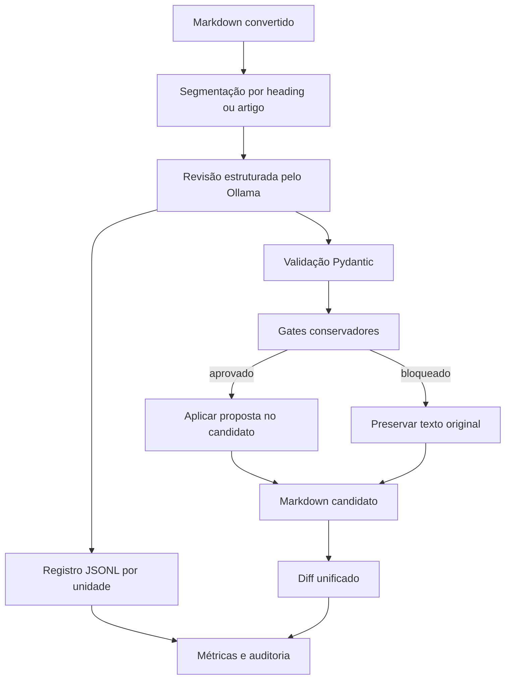

# Revisão de conversões por IA local

A revisão por IA local é uma etapa assistiva posterior à conversão. Ela não substitui o Markdown original, não altera o PDF e não constitui validação jurídica. Seu objetivo é localizar e propor correções de fidelidade documental, preservando rastreabilidade e intervenção humana.

## Princípios

- o original e o Markdown convertido permanecem imutáveis;
- cada chamada trabalha sobre uma unidade delimitada e identificada;
- números, datas, percentuais, referências legais e marcadores normativos são protegidos;
- alterações ambíguas são bloqueadas e mantêm o texto original;
- apenas unidades aprovadas pelos gates automáticos entram no candidato revisado;
- o resultado é sempre um artefato derivado, sujeito a validação humana.

## Fluxo



## Configuração padrão

O projeto lê do `.env` o endereço do Ollama, o modelo e os thresholds da revisão:

```dotenv
OLLAMA_BASE_URL=http://127.0.0.1:11434
OLLAMA_MODEL=qwen3:8b
OLLAMA_REVIEW_MAX_CHARS=8000
OLLAMA_REVIEW_MIN_CONFIDENCE=0.90
OLLAMA_REVIEW_MAX_CHANGE=0.20
OLLAMA_REVIEW_MAX_REMOVAL=0.08
```

O `--modelo` e os demais parâmetros continuam disponíveis na linha de comando somente para sobrescritas pontuais. A configuração efetivamente usada é persistida no processamento, garantindo reprodutibilidade e idempotência.

## Preparação do Ollama

O serviço deve estar ativo e o modelo configurado precisa estar disponível localmente:

```powershell
ollama list
ollama pull qwen3:8b
ollama serve
```

Em instalações nas quais o aplicativo Ollama já inicia como serviço, `ollama serve` não deve ser executado novamente.

## Execução

Com a configuração padrão no `.env`, a revisão de uma versão não exige informar o modelo:

```powershell
python manage.py revisar_markdown_ia --versao 1
```

Por documento ou aplicação:

```powershell
python manage.py revisar_markdown_ia --documento 1
python manage.py revisar_markdown_ia --aplicacao 1
```

Sobrescrita pontual do modelo:

```powershell
python manage.py revisar_markdown_ia --versao 1 --modelo OUTRO_MODELO_LOCAL
```

Sobrescrita dos gates:

```powershell
python manage.py revisar_markdown_ia `
  --versao 1 `
  --max-caracteres 8000 `
  --confianca-minima 0.90 `
  --alteracao-maxima 0.20 `
  --remocao-maxima 0.08
```

## Artefatos produzidos

| Artefato | Função |
|---|---|
| `documento-revisado-candidato.md` | candidato que aplica somente alterações aprovadas pelos gates |
| `revisao-ia.jsonl` | uma linha por unidade, com proposta, confiança, uso, motivos e decisão do gate |
| `diferencas-revisao.diff` | comparação unificada entre o Markdown convertido e o candidato |

## Gates automáticos

Uma proposta é bloqueada quando ocorre pelo menos uma destas condições:

- confiança inferior ao limite configurado;
- o próprio modelo exige validação humana;
- taxa de alteração acima do limite;
- remoção excessiva de caracteres;
- alteração de artigo, parágrafo, número, data, percentual, valor monetário ou referência legal;
- texto proposto vazio.

O bloqueio não descarta o registro. A proposta continua disponível no JSONL para inspeção e adjudicação humana, mas o candidato preserva o texto original daquela unidade.

## Métricas registradas

- unidades processadas;
- unidades com proposta;
- unidades autoaprovadas e bloqueadas;
- taxa de autoaprovação;
- caracteres antes e depois;
- hashes do Markdown de origem e do candidato;
- tokens de prompt e de resposta informados pelo Ollama;
- duração por chamada e duração total;
- similaridade, taxa de alteração e taxa de remoção por unidade;
- preservação de elementos normativos protegidos;
- modelo, versão do prompt, thresholds e artefato de origem.

## Tarefas e orquestração

O módulo `applications.revisao_ia` oferece:

- `tarefa_revisar_versao`: tarefa Prefect com uma retentativa controlada;
- `fluxo_revisar_versoes`: fluxo para lotes de versões;
- `executar_revisao_versao`: serviço síncrono usado pelo comando e pelos testes;
- `revisar_markdown`: núcleo independente de Django, adequado a ensaios e benchmarks.

## Limites

A etapa não deve modernizar redação, completar lacunas, corrigir conteúdo jurídico, renumerar dispositivos ou reconstruir tabelas e mapas ambíguos. Páginas visuais complexas continuam exigindo inspeção do PDF e, quando necessário, validação humana especializada.
